# HMMTensorflowAndroid

## 功能简介
1. 使用`expert-graph`模型实现手写数字识别
2. 使用`mobilenet_v1`和`mobilenet_v2`模型实现相册图片的图像分类
3. 使用`tensorflow_inception_graph`模型实现实时图像分类
4. 使用`graph-tiny-yolo-voc`模型实现实时图像目标检测
5. 使用`stylize_quantized`模型实现图像风格迁移
6. 使用`conv_actions_frozen`模型实现简单单词的语音识别
## 应用效果图

### 1.APP主界面

图1 APP主界面效果图

### 2.手写数字识别效果图
<table>
    <tr>
        <td >
图2-1 手写数字0
</td>
        <td >
图2-2 手写数字1
</td>
		<td >
图2-3 手写数字2
</td>
		<td >
图2-4 手写数字3
</td>		
    </tr>
	<tr>
        <td >
图2-5 手写数字4
</td>
        <td >
图2-6 手写数字5
</td>
		<td >
图2-7 手写数字6
</td>
		<td >
图2-8 手写数字7
</td>
    </tr>
	<tr>
        <td >
图2-9 手写数字8
</td>
		<td >
图2-10 手写数字9
</td>   
    </tr>

</table>

### 3.相册图片图像分类效果图
#### 3.1 `mobilenet_v1`模型识别效果图

图3-1 mobilenet_v1模型识别效果图

#### 3.2 `mobilenet_v2`模型识别效果图

图3-2 mobilenet_v2模型识别效果图

### 4.实时图像分类效果图

图4 实时图像分类效果图

### 5.实时图像目标检测效果图

图5 实时图像目标检测效果图

### 6.图像风格迁移效果图
<table>
    <tr>
        <td >
图6-1 图像风格迁移效果图1
</td>
        <td >
图6-2 图像风格迁移效果图2
</td>
		<td >
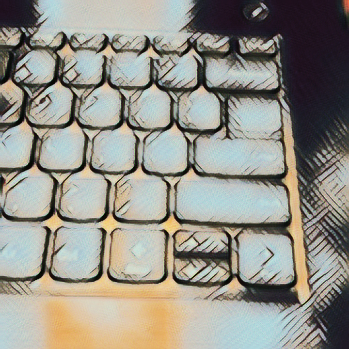图6-3 图像风格迁移效果图3
</td>
		<td >
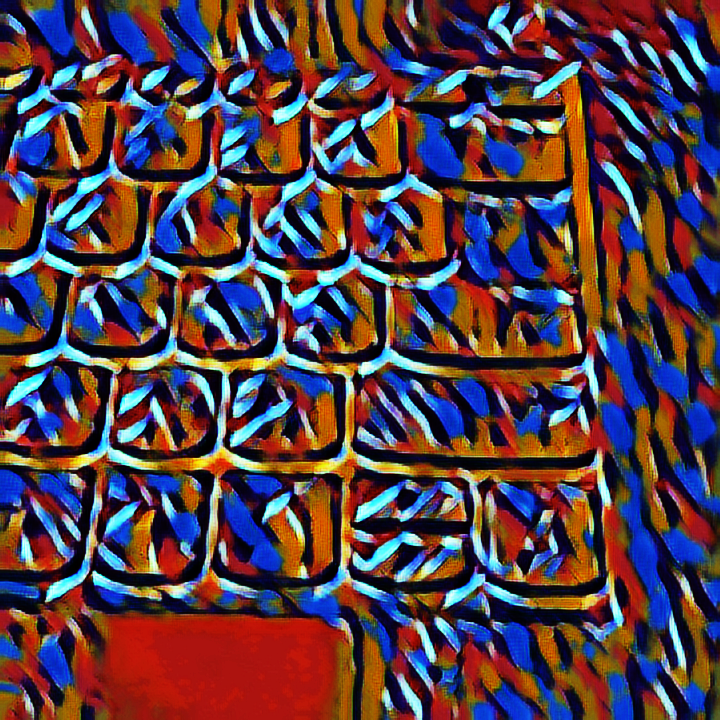图6-4 图像风格迁移效果图4
</td>	
		<td >
图6-5 图像风格迁移效果图5
</td>		
    </tr>
	<tr>
        <td >
图6-6 图像风格迁移效果图6
</td>
        <td >
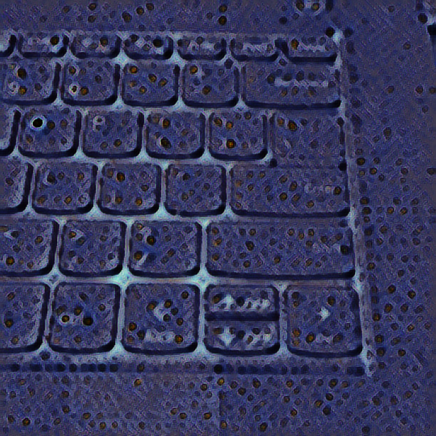图6-7 图像风格迁移效果图7
</td>
		<td >
图6-8 图像风格迁移效果图8
</td>
		<td >
图6-9 图像风格迁移效果图9
</td>
		<td >
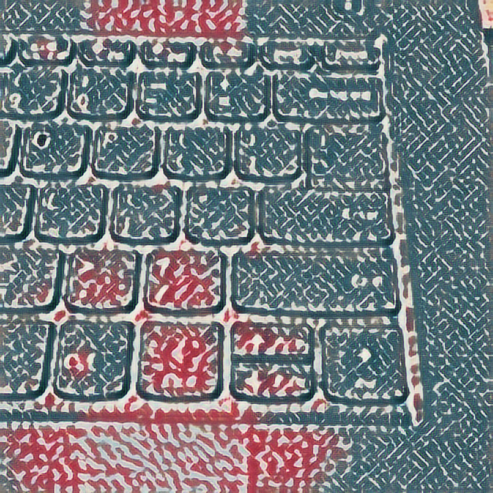图6-10 图像风格迁移效果图10
</td>  
    </tr>
	<tr>
        <td >
图6-11 图像风格迁移效果图11
</td>
        <td >
图6-12 图像风格迁移效果图12
</td>
		<td >
图6-13 图像风格迁移效果图13
</td>
		<td >
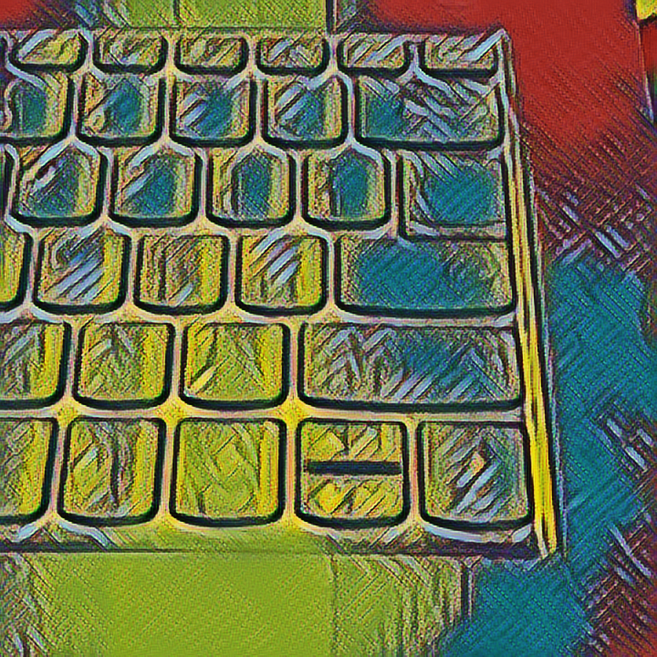图6-14 图像风格迁移效果图14
</td>
		<td >
图6-15 图像风格迁移效果图15
</td>  
    </tr>
	<tr>
        <td >
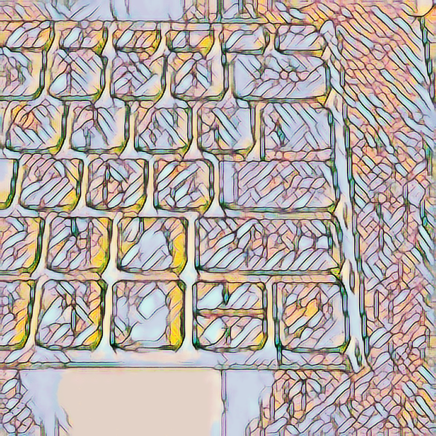图6-16 图像风格迁移效果图16
</td>
        <td >
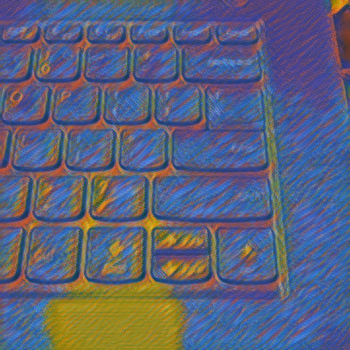图6-17 图像风格迁移效果图17
</td>
		<td >
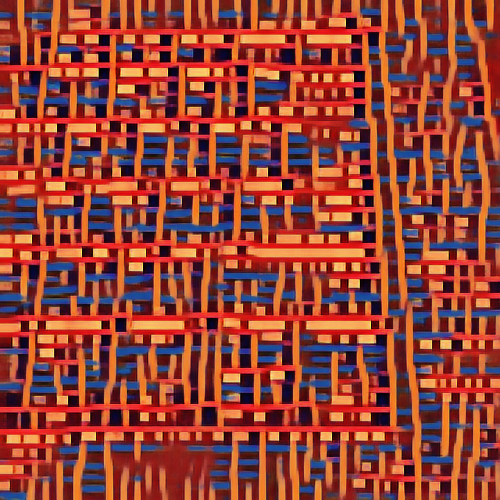图6-18 图像风格迁移效果图18
</td>
		<td >
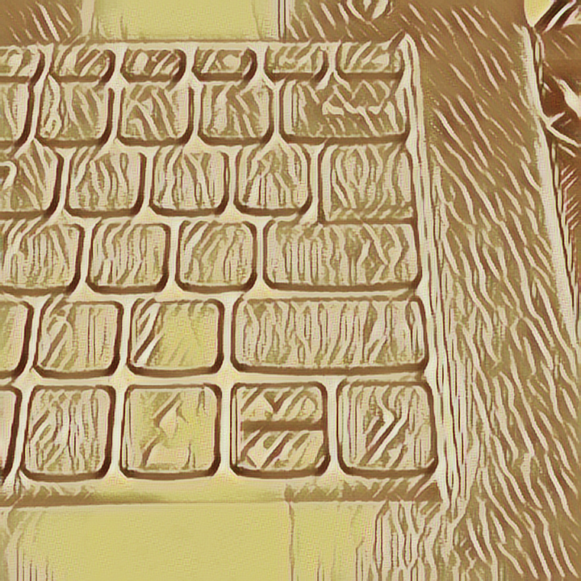图6-19 图像风格迁移效果图19
</td>
		<td >
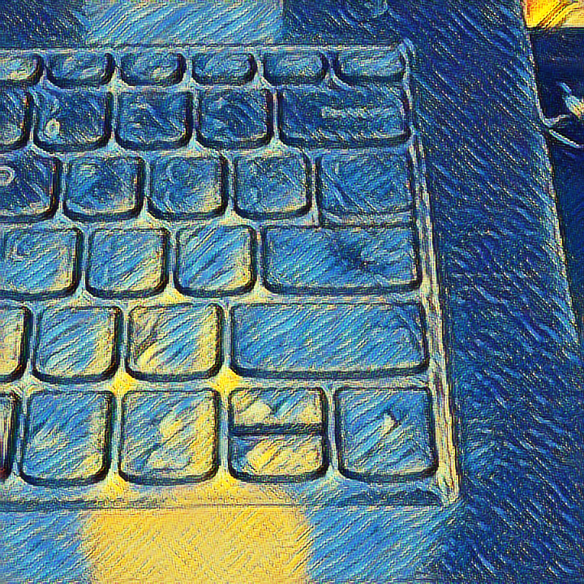图6-20 图像风格迁移效果图20
</td>  
    </tr>
	<tr>
        <td >
图6-21 图像风格迁移效果图21
</td>
        <td >
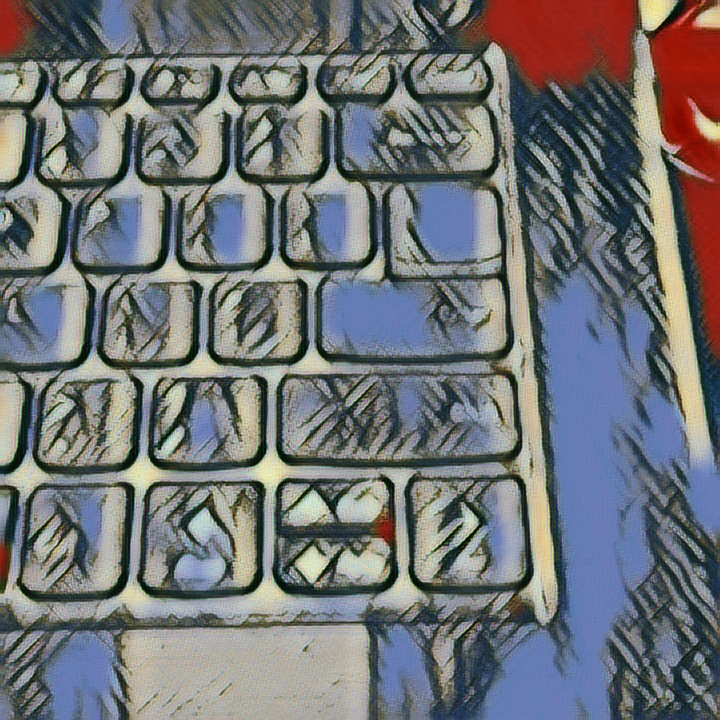图6-22 图像风格迁移效果图22
</td>
		<td >
图6-23 图像风格迁移效果图23
</td>
		<td >
图6-24 图像风格迁移效果图24
</td>
		<td >
图6-25 图像风格迁移效果图25
</td>  
    </tr>
</table>

### 7.单词语音识别效果图
<table>
	<tr>
        <td >
图7-1 单词语音识别界面图
</td>
		<td >
图7-2 单词“Yes”语音识别效果图
</td> 
		<td >
图7-3 单词“No”语音识别效果图
</td> 		
    </tr>
</table>

## 参考资料

* [Tensorflow-android 官方demo源码分析](https://blog.csdn.net/u013510838/article/details/79827119)
* [Tensorflow在手机端的部署——官网Android工程源码分析之TensorFlowYoloDetector.java](https://blog.csdn.net/c20081052/article/details/84387738)
* [Tensorflow-android 官方demo源码](https://github.com/tensorflow/tensorflow/tree/master/tensorflow/examples/android)
